  <picture>
    <source media="(prefers-color-scheme: dark)" srcset="./assets/banner-dark.svg">
    <source media="(prefers-color-scheme: light)" srcset="./assets/banner-light.svg">
    
  </picture>

  
  
  
  
  

  
<strong>Software engineer building backend systems, AI/LLM products, and developer tools.</strong>

## Tech Stack

<table>
  <tr>
    <td width="138"><strong>Languages</strong></td>
    <td>
      
      
      
      
      
    </td>
  </tr>
  <tr>
    <td><strong>Backend &amp; Web</strong></td>
    <td>
      
      
      
      
      
    </td>
  </tr>
  <tr>
    <td><strong>AI &amp; ML</strong></td>
    <td>
      
      
      
      
      
    </td>
  </tr>
  <tr>
    <td><strong>Databases</strong></td>
    <td>
      
      
      
      
    </td>
  </tr>
  <tr>
    <td><strong>Cloud &amp; DevOps</strong></td>
    <td>
      
      
      
      
      
    </td>
  </tr>
</table>
